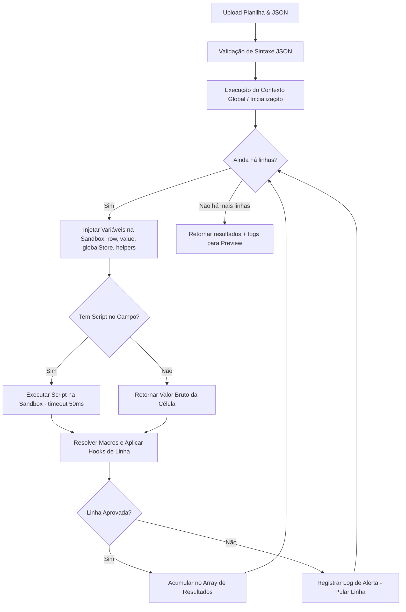

# Estudo Arquitetural — Motor de Importação Programável Baseado em JSON
## Documento: 16-ESTUDO-MOTOR-IMPORTACAO-PROGRAMAVEL.md

> [!NOTE]
> Este documento é um estudo conceitual detalhado para a criação de um **segundo motor de importação (Motor Programável)** para a plataforma. O motor existente (baseado em mapeamento direto/heurístico) continuará operando de forma simples para uploads declarativos comuns, enquanto este novo motor oferecerá flexibilidade total baseada em **scripts JavaScript embarcados em esquemas JSON**.

---

## 1. Visão Geral e Justificativa

Hoje, as empresas parceiras possuem layouts de planilhas extremamente heterogêneos. Algumas contêm colunas com regras complexas (ex: "se o valor de venda passar de X, a comissão é Y%, senão Z%"), ou necessitam que uma única linha seja desmembrada em diferentes regras de negócio (loops de parcelas, validações personalizadas).

A proposta deste **Motor Programável baseado em JSON** é transformar a importação em um **Interpretador Programável em Tempo de Execução**. Ele dará controle total ao Administrador Avançado (ou time de implantação) para criar fluxos de parser dinâmicos através de uma estrutura JSON flexível que combina declaração de colunas com lógica processável em JavaScript em ambiente seguro (Sandbox).

---

## 2. Comparativo: Motor 1 (Atual) vs. Motor 2 (Proposto)

| Recurso | Motor 1: Declarativo Estático (Atual) | Motor 2: Programável Dinâmico (Proposto) |
| :--- | :--- | :--- |
| **Abordagem** | Mapeamento direto coluna $\rightarrow$ campo do banco de dados. | Script procedural que processa dados por linha. |
| **Curva de Aprendizado**| Baixíssima (arrastar campos / auto-sugestão). | Média-Alta (necessita conhecimento básico de JSON/JS). |
| **Transformação de Dados**| Apenas conversões simples (fator, delimitador de string).| Modificações ilimitadas (conversões, regex, loops, condicionais). |
| **Lógica de Negócio** | Rígida (regras fixas de saldo/balão/FIFO). | Flexível (pode decidir o status, fracionamento e regras dinâmicas).|
| **Onboarding de Novos Clientes** | ⚠️ Cada novo layout de planilha exige intervenção manual do time de implantação para criar/ajustar perfis. | ✅ O time de implantação configura o JSON uma única vez e qualquer variação futura do cliente pode ser ajustada sem tocar no código da plataforma. |
| **Uso Ideal** | Empresas com planilhas padronizadas e limpas. | Clientes enterprise com ERPs legados ou regras ad-hoc. |

---

## 3. Arquitetura do Schema JSON e Enriquecimento do Modelo

Para simplificar a experiência e suportar desde mapeamentos ultra-diretos até lógicas avançadas de programação, propomos um modelo enriquecido baseado na ideia original enviada:

> [!TIP]
> **Facilidade Dual:** Se apenas informarmos a `"celula"`, o sistema assume o valor bruto de forma declarativa direta (pegar a célula diretamente). Se informarmos o `"script"`, o motor executa o bloco JavaScript injetando contextos e variáveis auxiliares.

### Exemplo de JSON de Configuração (Enriquecido e Customizável)

```json
{
  "versao_motor": "2.0",
  "configuracoes_gerais": {
    "linha_cabecalho": 1,
    "pular_linhas_vazias": true,
    "delimitador_lista": ";"
  },
  "contexto_global": {
    "script_inicializacao": "
      // Roda uma vez antes de iniciar o loop de linhas
      // NOTA: O vm nativo do Node NÃO suporta async/await.
      // Para buscar dados externos, use o globalStore pré-populado
      // pelo serviço antes de instanciar o motor (injeção explícita).
      globalStore.totalProcessado = 0;
      globalStore.fatorDolar = 5.25; // Valores externos são injetados pelo orquestrador
    "
  },
  "mapeamento_campos": {
    "NomeParceiro": {
      "celula": "A",
      "script": "
        // Pega o valor da coluna A e normaliza
        let nome = value.trim().toUpperCase();
        if (!nome) {
          throw new Error('Nome do parceiro não pode ser vazio!');
        }
        return nome;
      "
    },
    "DocumentoParceiro": {
      "celula": "B",
      "script": "
        // Limpa formatação de CPF/CNPJ (pega a célula B)
        return value.replace(/[^0-9]/g, '');
      "
    },
    "ValorVenda": {
      "celula": "C"
      // Sem script: pega o valor direto da célula C e converte em Float automaticamente
    },
    "CategoriaParceiro": {
      "celula": "D",
      "script": "
        // Condicional customizada para aplicar regras
        if (value === 'MASTER') {
          return 'senior';
        } else {
          return 'junior';
        }
      "
    },
    "TransacoesGeradas": {
      "script": "
        // Exemplo de enriquecimento complexo: Comando de FOR/LOOP
        // Cria múltiplas parcelas com base em dados de outras células!
        // Use o objeto `row` para acessar colunas diretamente.
        // Use {{NomeCampo}} para referenciar valores já processados nesta linha.
        
        let parcelas = [];
        let valorTotal = helpers.parseMoeda(row.E); // Coluna E: usa helper para R$ 1.500,00
        let qtdParcelas = parseInt(row.F) || 1; // Coluna F: Qtd Parcelas
        let dataInicio = new Date(row.G); // Coluna G: Vencimento Inicial
        
        let valorParcela = valorTotal / qtdParcelas;
        
        for (let i = 0; i < qtdParcelas; i++) {
          let dataVencimento = new Date(dataInicio);
          dataVencimento.setMonth(dataInicio.getMonth() + i);
          
          parcelas.push({
            tipo: 'CREDITO',
            status: 'PENDENTE',
            valor: valorParcela,
            data_vencimento: dataVencimento.toISOString().split('T')[0],
            dados_extras: {
              parcela_numero: (i + 1) + ' de ' + qtdParcelas,
              categoria_original: '{{CategoriaParceiro}}' // Macro de referência cruzada
            }
          });
        }
        
        return parcelas;
      "
    }
  },
  "hooks": {
    "antes_salvar_linha": "
      // Permite interceptar o resultado de cada linha
      // Se retornar false, pula a importação desta linha específica
      if (linhaResult.ValorVenda < 1000) {
        log.warning('Linha ignorada: Valor de venda abaixo do limite mínimo');
        return false;
      }
      return true;
    "
  }
}
```

---

## 4. Funcionamento Interno do Motor (Mecânica e Segurança)

Abaixo, descrevemos o fluxo de execução interna que o backend executaria ao receber a planilha e o JSON programável.



### 4.1. Ambiente Isolado (Sandbox)
Como o administrador pode digitar códigos Javascript arbitrários, executar isso diretamente no servidor Node.js seria um grave risco de segurança (vulnerabilidade de *Remote Code Execution* ou laços infinitos que travam a CPU).

Para mitigar isso de forma profissional, o motor utiliza o módulo nativo `vm` do Node.js ou a biblioteca `isolated-vm` (altamente recomendada):

1. **Timeout Rígido:** Cada script de linha tem um limite de tempo máximo (ex: `50ms`). Se o script entrar em loop infinito (`while(true)`), a sandbox interrompe a execução com erro imediato.
2. **Contexto Limitado:** O script não possui acesso a variáveis de sistema (`process`, `require`, `fs`, `global`). Não há suporte a `async/await` no contexto de VM (dados externos devem ser pré-carregados no `globalStore` antes da execução pelo orquestrador do serviço).
3. **Escopo Controlado:** Apenas dados controlados são fornecidos como entrada:
   - `value`: O valor da célula daquela coluna específica.
   - `row`: Um objeto contendo os valores de todas as colunas da linha atual (ex: `{ A: "Corretor X", B: "123.456...", C: 150000.00 }`).
   - `globalStore`: Um objeto compartilhado persistido entre as linhas para acumular dados (ex: contadores, taxas de câmbio pré-carregadas).
   - `{{NomeDoCampo}}`: Macros de referência cruzada para resgatar o valor de outros campos processados na mesma linha. Usam delimitadores `{{}}` para evitar colisões com nomes de variáveis JavaScript e substituições em cascata acidentais.
   - `helpers`: Funções pré-compiladas injetadas pelo sistema para ajudar no parser (ex: `helpers.parseMoeda("R$ 1.500,00")` $\rightarrow$ `1500.00`, `helpers.cleanCPF("123.456.789-00")` $\rightarrow$ `12345678900`).

---

## 5. Casos de Uso Práticos e Ideias Adicionais

Aqui estão cenários complexos onde o motor programável brilha em relação ao motor declarativo simples:

### Caso A: Conversão Automática de Moedas Estrangeiras
Se o cliente recebe comissões em Dólar (USD) ou Euro (EUR) e quer converter em Talentos no momento do processamento com uma taxa obtida em tempo de execução:
```javascript
// Script do campo 'ValorTalentos' pegando a célula C (em Dólar)
let valorDolar = parseFloat(value);
let taxaConversao = 5.25; // Poderia vir de um contexto global consultado na API do Banco Central no início
return valorDolar * taxaConversao;
```

### Caso B: Regra de Comissionamento Escalonada (Tiers)
A planilha informa apenas o valor da venda, mas o valor do talento a ser pago depende do nível do profissional:
```javascript
// Campo 'ValorBrutoTalentos'
let vgv = parseFloat(row.D); // Coluna D: VGV do Imóvel
let categoria = @CategoriaParceiro; // Resgata resultado processado anteriormente na mesma linha

if (categoria === 'senior') {
  return vgv * 0.02; // 2% de comissão para sênior
} else if (categoria === 'junior') {
  return vgv * 0.01; // 1% para júnior
} else {
  return vgv * 0.005; // 0.5% default
}
```

### Caso C: Desmembramento de "Datas Múltiplas" Não-Padrão
Às vezes o cliente não usa um separador clássico, mas datas dispostas em colunas alternadas (ex: Coluna H, J, L). O script pode agrupar e retornar um array estruturado de recebimentos em uma única passagem:
```javascript
let datas = [];
let valores = [];

if (row.H) { datas.push(row.H); valores.push(row.I); } // Parcela 1
if (row.J) { datas.push(row.J); valores.push(row.K); } // Parcela 2
if (row.L) { datas.push(row.L); valores.push(row.M); } // Parcela 3

return datas.map((dt, idx) => ({
  data_vencimento: dt,
  valor: parseFloat(valores[idx]),
  status: 'PENDENTE'
}));
```

---

## 6. Painel de Simulação Avançada e Editor Visual No-Code (UI/UX)

Para tornar esse motor amigável e acessível para administradores que não sabem programar, a plataforma pode oferecer duas experiências de autoria complementares:

### 6.1. Experiência Avançada (Code-First)
1. **Editor de Configuração:** Um editor com realce de sintaxe JSON (ex: Monaco Editor, o mesmo do VS Code) no lado esquerdo da tela.
2. **Terminal de Logs & Preview Real-time:** Um painel no lado direito que, ao subir uma planilha modelo, mostra:
   - **Tabela de Preview:** O resultado interpretado de cada linha.
   - **Console Virtual:** Saída de mensagens para depuração (ex: `log.info("Processando linha 5...")`).
   - **Relatório de Inconsistências:** Erros de sintaxe ou exceções disparadas dentro dos scripts.

---

### 6.2. Editor de Fluxos Visual (No-Code / Estilo N8N & Node-RED)
Em vez de escrever JSON ou scripts manualmente, o usuário pode montar o fluxo de importação conectando blocos de forma totalmente visual!

#### Como Funciona a Engenharia Bidirecional (Diagrama $\leftrightarrow$ JSON)
Tudo que é desenhado na tela é mapeado para um formato JSON estruturado (Abstract Syntax Tree - AST). Ao salvar, o frontend converte o diagrama de nós em JSON para o Motor processar. Ao abrir, o frontend lê o JSON e redesenha os nós e suas conexões na tela perfeitamente!

#### Componentes (Nós) Disponíveis:
1. **Gatilho de Linha (Excel Row Input Node):** Inicia o fluxo para cada linha da planilha. Expõe saídas dinâmicas para cada coluna (ex: `Coluna A`, `Coluna B`).
2. **Transformadores de String:** `Limpar Caracteres Especiais` (ex: remover pontos/traços do CPF), `Maiúsculas/Minúsculas`, `Regex Parser`.
3. **Transformadores de Cálculos:** `Somar`, `Multiplicar` (ex: multiplicar coluna C por fator de conversão).
4. **Nós de Controle (Condicionais):**
   - **If / Else (Se/Senão):** Direciona o fluxo com base em condições (ex: `Se Categoria == 'MASTER'`).
   - **Switch (Múltiplas Opções):** Direciona para diferentes canais dependendo do valor da célula.
5. **Nó de Repetição (For / Loops):** Recebe um valor numérico (ex: `Quantidade de Parcelas`) e duplica a saída do fluxo $N$ vezes, incrementando datas automaticamente.
6. **Nós Geradores Financeiros (Sinal, Parcelas, Balões):** Nós especializados em criar transações financeiras automaticamente, sem precisar de programação em JavaScript para regras comuns.
   - **Exemplo Prático: Gerador de Entrada (Sinal)**
     - **Portas de Conexão:** Possui entradas visuais para ligar as colunas do Excel correspondentes ao `Valor (Moeda)` e `Vencimento (Data)`.
     - **Painel de Configuração:** O administrador escolhe o `Status de Entrada` inicial (ex: *Compensado* ou *Pendente*) e define a `Justificativa da Transação`.
     - **Poder das Macros:** A justificativa suporta macros como `Entrada de Contrato - {{C}}`. O motor de processamento intercepta o `{{C}}`, busca na **Coluna C** daquela respectiva linha do Excel e substitui em tempo real. (Ex: se na coluna C estiver "João", a transação salva será *"Entrada de Contrato - João"*).
     - **Conversão Code-Gen:** Por trás dos panos, o fluxo visual traduz essa configuração em um script que monta o objeto JSON de transação completo e o empurra para o banco de dados.
7. **Destino (Database Output Node):** Grava a transação com os valores resultantes na tabela `GamTransacao`. Este nó representa o ponto final de escrita da esteira de dados e possui a seguinte arquitetura detalhada:
   - **Portas de Entrada Dinâmicas (Input Connectors):**
     - `Valor em Talentos` (Obrigatório): Recebe a saída numérica final de pontos após fator de conversão.
     - `Valor Original R$` (Opcional): Recebe o valor financeiro bruto da comissão ou venda.
     - `Data de Vencimento` (Obrigatório): Recebe a data processada do vencimento.
     - `Data de Compensação` (Opcional): Recebe a data de liquidação (preenchida caso o status seja COMPENSADO).
     - `Empreendimento` & `Unidade` (Opcional): Informações de rastreamento do produto/contrato.
     - `Contato Cliente` (Opcional): Dados para fins de apoio de cobrança futura.
     - `Dados Extras (JSON)`: Uma entrada especial do tipo objeto que aceita conexões de quaisquer outras colunas da planilha (ex: *Gerente de Vendas, Canal de Captação, Regional*). Todos esses valores são empacotados e gravados automaticamente no payload JSON de metadados `GamTransacao.dados_extras`.
   - **Propriedades Internas (Configurações do Nó):**
     - **Tipo de Lançamento:** Dropdown estático (`CREDITO`, `DEBITO`, `ESTORNO`) ou ligação dinâmica.
     - **Status de Lançamento:** Dropdown estático (`PENDENTE`, `COMPENSADO`, `RESGATADO`) ou expressão condicional lógica.
     - **Origem da Transação:** Definido automaticamente como `IMPORTACAO`.
   - **Lógica de Resolução de Usuário (`usuario_id`):**
     - O nó possui uma configuração de **Chave de Resolução** para encontrar o Corretor/Parceiro correto no banco.
     - O administrador configura quais entradas representam a identificação (ex: ligar o conector da coluna de *CPF* na propriedade `Identificador Principal` ou o *Nome* na propriedade `Identificador Secundário`).
     - Durante a execução, o motor busca o usuário exato na tabela `GamUsuario` combinando as chaves. Se houver duplicidade ou nenhum usuário for encontrado, a linha é isolada como **Inconsistência de Ambiguidade** e mostrada no painel de preview para que o administrador resolva a identidade manualmente antes de persistir o lote financeiro definitiva e transacionalmente.
   - **Suporte a Arrays (Parcelas Múltiplas):**
     - Caso o nó anterior seja um **Nó de Repetição (For)** que gerou um array de parcelas, o nó de destino inteligentemente executa uma gravação em lote de forma sequencial (iterando sobre o array) para aquela mesma linha da planilha.


#### Mockup da Interface Visual (Estilo N8N / Glassmorphic):
Aqui está o conceito visual de como essa tela do Editor No-Code seria construída para o V-Talentos, combinando beleza, produtividade e simplicidade técnica:


---


## 7. Sugestões Estratégicas de Produto e Evolução (Ideias de Ouro)

Para levar esse motor a um nível disruptivo de mercado, mapeamos 5 sugestões estratégicas de produto que podem ser integradas ao ecossistema No-Code:

### 7.1. IA Copilot para Geração de Fluxos (Natural Language to Node Graph)
Embora os nós facilitem a vida, muitos usuários ainda podem travar na lógica inicial.
* **A Ideia:** Um pequeno campo de texto no topo do editor onde o usuário escreve em linguagem natural:
  > *"Importe a planilha de corretores usando a coluna A como nome e a B como CPF. Se a coluna C for maior que 10.000, divida em 12 parcelas mensais na tabela de transações."*
* **A Engenharia:** A IA processa o comando, gera a estrutura JSON equivalente e **renderiza o grafo na tela instantaneamente**. O usuário apenas revisa visualmente as ligações, faz pequenos ajustes finos e salva.

### 7.2. Hot-Preview Reativo e Depurador Visual
Ao configurar um fluxo complexo, é vital que o administrador saiba se a lógica está funcionando antes de rodar o lote real.
* **A Ideia:** O usuário arrasta uma planilha de exemplo para dentro do editor.
* **A Engenharia:** À medida que ele conecta os nós visuais, o editor executa a linha 1 da planilha em tempo real e mostra um painel lateral dinâmico de preview.
* **Depuração Dinâmica:** Se um nó falhar (ex: divisão por zero ou campo de data inválido), o nó correspondente **acende em vermelho com uma aura pulsante** indicando exatamente onde a esteira de processamento quebrou.

### 7.3. Hub de Templates Pré-Mapeados
Empresas comumente utilizam ERPs de mercado conhecidos (ex: Salesforce, Hubspot, CRM Imobiliário, Seguradora X).
* **A Ideia:** Disponibilizar uma galeria de templates na plataforma.
* **A Engenharia:** Ao clicar em *"Template Comissões Salesforce"*, o editor visual carrega o grafo completo pré-configurado. O usuário apenas ajusta qual conector de banco de dados quer usar como destino final.

### 7.4. Versionamento de Configurações (Rollback Seguro)
Como essas importações lidam diretamente com o fluxo financeiro de pagamentos e talentos, segurança e integridade são leis.
* **A Ideia:** Toda vez que um perfil de fluxo é alterado, o sistema cria uma nova versão histórica (ex: v1, v2, v3).
* **A Engenharia:** Se um administrador alterar um nó e gerar pagamentos incorretos, o super-admin pode acessar o histórico de versões, comparar as mudanças visuais em um painel do tipo diff e restaurar a versão anterior (Rollback) em 1 clique.

### 7.5. O Nó Escape Hatch (Nó de Código Puro)
Por mais completo que um editor No-Code seja, sempre existirá uma regra de negócio de algum cliente específico que nenhuma caixinha visual conseguirá prever.
* **A Ideia:** O nó especial **"Bloco de Código Personalizado"**.
* **A Engenharia:** Um nó que possui uma entrada e uma saída configurável, onde o usuário pode abrir uma pequena aba de texto e escrever JavaScript customizado de 2 ou 3 linhas para lógicas ultra-específicas. Isso garante que a ferramenta seja 98% No-Code, mas tenha 100% de flexibilidade para casos extremos.

---

## 8. Governança de Documentação: O Manual Vivo e Contínuo (Doc-as-Code)

Um motor programável e visual só é tão bom quanto a sua documentação. Para garantir que o manual do motor **nunca fique desatualizado** após qualquer modificação no código da plataforma, propomos uma estrutura rígida baseada em **Doc-as-Code** (Documentação como Código).

### 8.1. O Formato do Documento: Markdown + MDX Interativo
* **Onde fica:** O manual deve ser escrito em arquivos **Markdown (`.md` ou `.mdx`)** hospedados diretamente dentro do repositório Git do projeto (ex: `/docs/motor-importacao/`).
* **Por que Markdown/MDX?**
  1. **Controle de Versão:** Por estar no Git, a documentação é versionada exatamente junto com o código. Se a versão `v2.4` do motor alterar o comportamento de um nó, o manual da versão `v2.4` descreverá essa mudança, enquanto a documentação da `v2.3` permanecerá intacta no branch respectivo.
  2. **Interatividade (MDX):** O painel administrativo pode renderizar esses arquivos Markdown na tela de ajuda utilizando MDX. Isso permite que caixas de preview de simulação de nós rodem de verdade dentro da própria documentação!

### 8.2. Validação Automática via CI/CD (Garantia de Atualização)
Para impedir o esquecimento humano, o pipeline de integração contínua (CI/CD) do projeto assume o controle:
* **Gatilho de Verificação (Commit Hooks):** Se houver qualquer modificação nos arquivos do motor de importação (ex: `ImportacaoController.js` ou scripts de parsing), o pipeline de CI/CD (GitHub Actions / GitLab CI) verifica se os arquivos da pasta `/docs/` também receberam um diff de edição no mesmo Pull Request.
* **Quebra de Build:** Caso o código tenha sido alterado mas a documentação não, **o build é bloqueado** com uma mensagem de alerta para o desenvolvedor:
  > *[Erro de Governança]: Você alterou o Motor de Importação, mas não atualizou o Manual Técnico na pasta /docs. Por favor, documente a alteração para desbloquear o merge.*

### 8.3. Testes Automatizados dos Exemplos do Manual
Outro grande problema de manuais técnicos é quando os exemplos descritos param de funcionar por atualizações de sintaxe.
* **A Solução:** Um script de testes automatizados (`Jest`/`Vitest`) varre todos os blocos de código Javascript de exemplo descritos no manual e **executa-os contra a sandbox de testes**. Se algum exemplo de script no manual falhar ou gerar erro de runtime, os testes gerais falham, garantindo que 100% dos exemplos descritos na ajuda estejam sempre corretos e funcionais.

---

## 9. Protótipo Técnico do Backend (Como o Código Node.js Processa o JSON)

Para demonstrar a viabilidade prática da arquitetura, projetamos o protótipo funcional do serviço em **Node.js** utilizando o módulo nativo `vm` (Virtual Machine) para criar a sandbox segura de execução.

Este protótipo lê a configuração JSON, mapeia as colunas, resolve macros dinâmicas (`@Campo`), executa scripts em tempo de execução e processa as regras de negócio de cada linha de forma isolada.

### O Protótipo: `MotorImportacaoProgramavelService.js`

```javascript
const vm = require('vm');

class MotorImportacaoProgramavelService {
  constructor(configJson) {
    this.config = typeof configJson === 'string' ? JSON.parse(configJson) : configJson;
    this.globalStore = {}; // Estado persistido de linha para linha
  }

  /**
   * Processa uma lista de linhas extraídas da planilha Excel/CSV
   * @param {Array<Object>} rows - Exemplo: [{ A: "Corretor X", B: "123.456.789-00", C: "R$ 150.000,00" }]
   */
  async processar(rows) {
    const resultados = [];
    const logs = [];

    // 1. Executa o Script de Inicialização Global (se houver)
    if (this.config.contexto_global?.script_inicializacao) {
      this.executarScriptGlobal(this.config.contexto_global.script_inicializacao, logs);
    }

    // 2. Loop principal por cada linha da planilha
    for (let index = 0; index < rows.length; index++) {
      const rawRow = rows[index];
      const numeroLinha = index + 1;

      try {
        // Pula linhas vazias se configurado
        if (this.config.configuracoes_gerais?.pular_linhas_vazias && Object.values(rawRow).every(v => !v)) {
          continue;
        }

        // 3. Processa e resolve todos os campos da linha
        const linhaProcessada = this.processarLinha(rawRow, numeroLinha, logs);

        // 4. Executa os hooks de validação ("antes_salvar_linha")
        if (this.config.hooks?.antes_salvar_linha) {
          const aprovada = this.executarHookLinha(this.config.hooks.antes_salvar_linha, linhaProcessada, logs);
          if (!aprovada) {
            logs.push(`[Linha ${numeroLinha}] Pulada pelo hook antes_salvar_linha.`);
            continue;
          }
        }

        resultados.push({
          linha: numeroLinha,
          dados: linhaProcessada
        });

      } catch (error) {
        logs.push(`[Linha ${numeroLinha}] ERRO CRÍTICO DE PARSING: ${error.message}`);
      }
    }

    return { resultados, logs };
  }

  /**
   * Processa campos de uma única linha resolvendo scripts e mapeamentos de células
   */
  processarLinha(rawRow, numeroLinha, logs) {
    const linhaResult = {};
    const camposMapeados = this.config.mapeamento_campos;

    // Criamos os helpers utilitários que serão injetados na Sandbox
    const helpers = {
      parseMoeda: (val) => {
        if (val === null || val === undefined || val === '') return 0;
        // Suporta: "R$ 1.500,00", "1500,00", "1.500.000,00", "1500.00" (formato americano)
        let str = String(val);
        // Remove símbolos de moeda e espaços
        str = str.replace(/[R$\s]/g, '');
        // Detecta formato brasileiro (vírgula como decimal, ponto como milhar)
        if (str.match(/^-?[\d.]+,[\d]{2}$/)) {
          str = str.replace(/\./g, '').replace(',', '.');
        } else {
          // Assume formato numérico simples ou americano
          str = str.replace(/,/g, '');
        }
        const parsed = parseFloat(str);
        return isNaN(parsed) ? 0 : parsed;
      },
      cleanCPF: (val) => {
        if (!val) return '';
        return String(val).replace(/[^0-9]/g, '');
      },
      somarMeses: (dataStr, meses) => {
        const dt = new Date(dataStr);
        dt.setMonth(dt.getMonth() + meses);
        return dt.toISOString().split('T')[0];
      }
    };

    // Loop de resolução em duas passadas para garantir que macros @Campo acessem valores mapeados
    const chavesCampos = Object.keys(camposMapeados);

    // Passo 1: Resolve mapeamentos estáticos simples (celula direta) e executa scripts independentes
    for (const campo of chavesCampos) {
      const meta = camposMapeados[campo];
      const rawValue = meta.celula ? rawRow[meta.celula] : undefined;

      if (meta.script) {
        // Se tem script, roda na sandbox isolada
        linhaResult[campo] = this.executarScriptCampo(meta.script, rawValue, rawRow, helpers, linhaResult);
      } else {
        // Caso simples: pega a célula diretamente
        linhaResult[campo] = this.normalizarValorEstatico(rawValue);
      }
    }

    return linhaResult;
  }

  /**
   * Roda um script de campo dentro de um contexto isolado na VM do Node
   */
  executarScriptCampo(scriptCode, value, row, helpers, linhaResult) {
    // Resolve macros do tipo {{NomeCampo}} substituindo pelo valor já resolvido.
    // Usamos delimitadores {{ }} em vez de @Campo para evitar:
    //   1) Colisões com nomes de variáveis JS (ex: @new, @if)
    //   2) Regex com caracteres especiais em nomes de campos
    //   3) Substituições em cascata se um valor contiver outra macro
    let codigoTratado = scriptCode;
    for (const campoResolvido of Object.keys(linhaResult)) {
      // Escapa o nome para uso seguro em regex (ex: campo com ponto ou parêntese)
      const nomeEscapado = campoResolvido.replace(/[.*+?^${}()|[\]\\]/g, '\\$&');
      const regex = new RegExp(`\\{\\{${nomeEscapado}\\}\\}`, 'g');
      const val = JSON.stringify(linhaResult[campoResolvido]);
      codigoTratado = codigoTratado.replace(regex, val);
    }

    // Define o escopo da sandbox (limites rígidos de contexto)
    const sandbox = {
      value, // Valor bruto da célula mapeada
      row,   // Linha inteira do Excel (ex: row.A, row.B)
      globalStore: this.globalStore, // Estado compartilhado persistente
      helpers, // Funções auxiliares
      result: null // Receptor do retorno
    };

    const context = vm.createContext(sandbox);
    
    // Encapsula o script do usuário para capturar o retorno de forma limpa
    const scriptEnvelopado = new vm.Script(`
      (function() {
        ${codigoTratado}
      })()
    `);

    // Executa com limite máximo de tempo de 50ms para evitar laços infinitos (travamentos de CPU)
    const retorno = scriptEnvelopado.runInContext(context, { timeout: 50 });

    return retorno !== undefined ? retorno : context.result;
  }

  executarScriptGlobal(scriptCode, logs) {
    const sandbox = {
      globalStore: this.globalStore,
      db: {
        getUsuariosAtivos: async () => ['CORRETOR_A', 'CORRETOR_B'] // Mock de DB
      }
    };
    const context = vm.createContext(sandbox);
    try {
      const script = new vm.Script(scriptCode);
      script.runInContext(context, { timeout: 100 });
    } catch (e) {
      logs.push(`[Script Global] Erro na inicialização: ${e.message}`);
    }
  }

  executarHookLinha(hookCode, linhaResult, logs) {
    const sandbox = {
      linhaResult,
      globalStore: this.globalStore,
      log: {
        warning: (msg) => logs.push(`[Hook Warning] ${msg}`),
        info: (msg) => logs.push(`[Hook Info] ${msg}`)
      }
    };
    const context = vm.createContext(sandbox);
    const script = new vm.Script(`
      (function() {
        ${hookCode}
      })()
    `);
    return script.runInContext(context, { timeout: 50 }) !== false;
  }

  normalizarValorEstatico(value) {
    if (value === undefined || value === null) return null;
    // Se parecer um número, converte
    if (typeof value === 'string' && !isNaN(value.trim()) && value.trim() !== '') {
      return parseFloat(value);
    }
    return value;
  }
}

module.exports = MotorImportacaoProgramavelService;
```

---

## 10. Conclusão

> [!IMPORTANT]
> A fusão de um motor programável robusto em sandbox, um Editor No-Code visual e uma governança automatizada de documentação (Manual Vivo via Doc-as-Code) transformará a plataforma V-Talentos em uma **infraestrutura robusta de orquestração financeira flexível**, posicionando a arquitetura no mesmo patamar de plataformas integradoras líderes de mercado como Make.com e N8N, porém otimizada nativamente para ecossistemas de fidelidade, conta corrente e gamificação.

**Como sugestão de evolução técnica:**
- Utilizar a biblioteca **React Flow** ou **Litegraph.js** para renderização rápida e estável do mapa de nós no frontend.
- Padronizar o barramento de eventos e a AST (Abstract Syntax Tree) do JSON para garantir portabilidade completa.
- Implementar as regras de pipeline de CI/CD detalhadas na Seção 8 para manter a documentação indestrutível.


